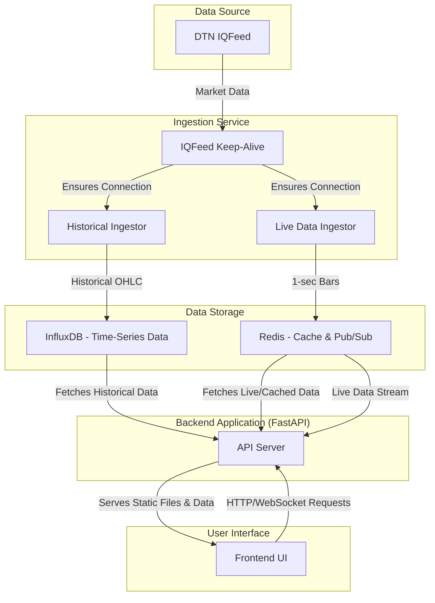

# Real-Time Trading Charting Platform

This project is a comprehensive, real-time financial charting platform designed to display historical and live market data. It features a Python-based backend using FastAPI and a dynamic, interactive frontend built with HTML, CSS, and JavaScript, leveraging the Lightweight Charts™ library for high-performance financial visualizations.

## Table of Contents

  - [Architecture and Data Flow](https://www.google.com/search?q=%23architecture-and-data-flow)
  - [Key Features](https://www.google.com/search?q=%23key-features)
  - [Disabled Features](https://www.google.com/search?q=%23disabled-features)
  - [Getting Started](https://www.google.com/search?q=%23getting-started)
      - [Prerequisites](https://www.google.com/search?q=%23prerequisites)
      - [Installation](https://www.google.com/search?q=%23installation)
  - [Running the Application](https://www.google.com/search?q=%23running-the-application)
  - [Project Structure](https://www.google.com/search?q=%23project-structure)
  - [Key Technologies](https://www.google.com/search?q=%23key-technologies)

## Architecture and Data Flow

The platform is composed of three primary components: a data **Ingestion Service**, a backend **Application Server**, and a web-based **Frontend**.



**Data Flow Explained:**

1.  **Data Ingestion**: The `ingestion_service` is responsible for acquiring data from the **DTN IQFeed** service.

      * A **Keep-Alive Script (`iqfeed_keep_alive.py`)** ensures that the IQFeed connection is always active.
      * The **Historical Ingestor (`iqfeed_ingestor.py`)** backfills historical data for various timeframes (1s, 5s, 1m, etc.) and stores it in an **InfluxDB** time-series database.
      * The **Live Data Ingestor (`live_data_ingestor.py`)** captures real-time trades, aggregates them into 1-second bars, and publishes these bars to a **Redis** Pub/Sub channel. It also maintains a cache of the current day's bars in a Redis list.

2.  **Backend API**: The FastAPI `app` serves as the core backend.

      * It provides REST endpoints for fetching historical data from **InfluxDB**. This data is cached in **Redis** to accelerate subsequent requests.
      * It exposes a WebSocket endpoint that subscribes to the **Redis** Pub/Sub channel to stream live data to connected clients. It also uses a `BarResampler` to aggregate the 1-second bars from Redis into any user-requested timeframe (e.g., 5-minute, 1-hour) on the fly.

3.  **Frontend Client**: The user interacts with the system through the `frontend`.

      * On initial load, it fetches a chunk of historical data from the backend API to display the chart.
      * As the user scrolls back in time, it requests older data chunks on-demand.
      * When "Live" mode is activated, it establishes a WebSocket connection to receive real-time bar updates, which are seamlessly merged into the chart.

## Key Features

  * **Real-Time & Historical Charting**: Displays both live-updating and historical OHLCV (Open, High, Low, Close, Volume) data.
  * **Dynamic Timeframes**: Supports multiple time intervals from seconds to daily, with on-the-fly resampling of live data.
  * **Interactive UI**: Built with **Lightweight Charts™**, allowing for smooth panning, zooming, and drawing.
  * **Drawing Tools**: Includes essential charting tools like Trend Lines, Horizontal Lines, Fibonacci Retracements, and Rectangles.
  * **Performance Optimized**: Utilizes Redis for caching historical data and a WebSocket connection for efficient live data streaming.
  * **Robust Data Ingestion**: Features a dedicated service to ensure a stable connection to the IQFeed data provider and backfill data reliably.
  * **Theming**: Supports both light and dark modes for user comfort.

## Disabled Features

The project contains code for additional features that are currently disabled but can be activated by uncommenting the relevant sections:

  * **Strategy Optimization**: The API endpoint (`/optimize`) for running backtesting and optimization tasks is commented out in `app/main.py` and `app/schemas.py`.
  * **Strategy Loader**: The automatic loading of trading strategies on startup is also disabled in `app/main.py`.

## Getting Started

Follow these instructions to set up and run the project on your local machine.

### Prerequisites

  * Python 3.9+
  * [IQConnect client](http://www.iqfeed.net/dev/main.cfm) from DTN
  * Redis Server
  * InfluxDB v2.x
  * A valid DTN IQFeed subscription

### Installation

1.  **Clone the Repository**:

    ```bash
    git clone <repository-url>
    cd trading_platform_v5
    ```

2.  **Set Up Python Environment**:
    It is recommended to use a virtual environment.

    ```bash
    python -m venv venv
    source venv/bin/activate  # On Windows, use `venv\Scripts\activate`
    ```

3.  **Install Dependencies**:
    Install all required Python packages using the `requirements.txt` file.

    ```bash
    pip install -r requirements.txt
    ```

4.  **Configure Environment Variables**:
    Create a `.env` file in the project's root directory by copying the example:

    ```
    # InfluxDB Credentials
    INFLUX_URL=http://localhost:8086
    INFLUX_TOKEN=your_influx_db_token
    INFLUX_ORG=your_influx_org
    INFLUX_BUCKET=your_bucket_name

    # Redis URL
    REDIS_URL=redis://localhost:6379/0

    # DTN IQFeed Credentials
    DTN_PRODUCT_ID=your_product_id
    DTN_LOGIN=your_login
    DTN_PASSWORD=your_password
    ```

    Fill in your credentials for InfluxDB and DTN IQFeed.

5.  **Set Up InfluxDB**:
    Ensure your InfluxDB instance is running and that the bucket specified in your `.env` file exists.

## Running the Application

The platform consists of several services that must be run. It's recommended to run each command in a separate terminal.

1.  **Start the IQFeed Keep-Alive Watchdog**:
    This script ensures that the `IQConnect.exe` client is always running.

    ```bash
    python ingestion_service/iqfeed_keep_alive.py
    ```

2.  **Start the Live Data Ingestor**:
    This service streams live data from IQFeed to Redis.

    ```bash
    python ingestion_service/live_data_ingestor.py
    ```

3.  **Run Historical Data Ingestion (Optional but Recommended)**:
    This script backfills your InfluxDB with historical data.

    ```bash
    python ingestion_service/iqfeed_ingestor.py
    ```

4.  **Start the Backend API Server**:
    This command starts the main FastAPI application.

    ```bash
    uvicorn app.main:app --host 0.0.0.0 --port 8000 --reload
    ```

5.  **Access the Frontend**:
    Open a web browser and navigate to `http://localhost:8000`.

## Project Structure

```
.
├── app/                  # FastAPI Backend
│   ├── routers/          # API endpoint definitions
│   ├── services/         # Business logic for data handling
│   ├── config.py         # Backend configuration
│   └── main.py           # FastAPI application entry point
├── frontend/             # HTML, CSS, and JavaScript UI
│   ├── static/           # Static assets (CSS, JS)
│   └── index.html        # Main HTML file
├── ingestion_service/    # Data acquisition and storage
│   ├── pyiqfeed/         # Library for IQFeed communication
│   ├── dtn_iq_client.py  # Manages IQFeed connection
│   ├── iqfeed_ingestor.py # Historical data ingestor
│   ├── live_data_ingestor.py # Live data ingestor
│   └── iqfeed_keep_alive.py # IQFeed watchdog
├── redis_monitor.py      # Utility to check Redis status
└── requirements.txt      # Python dependencies
```

## Key Technologies

  * **Backend**: Python, FastAPI, Uvicorn
  * **Data Storage**: InfluxDB, Redis
  * **Data Source**: DTN IQFeed
  * **Frontend**: HTML5, CSS3, JavaScript
  * **Charting Library**: Lightweight Charts™
  * **UI Framework**: DaisyUI, Tailwind CSS

-----